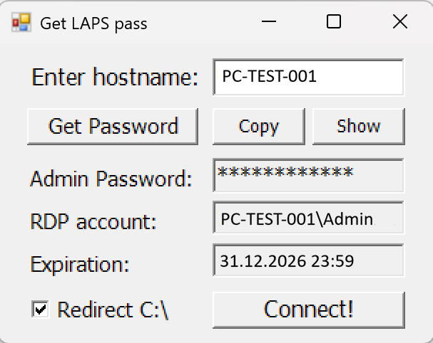

# LAPS Password RDP Tool

PowerShell GUI tool for retrieving Windows LAPS passwords from Active Directory and launching Remote Desktop (RDP) sessions to managed endpoints.

This utility simplifies the workflow for IT administrators and service desk engineers working with LAPS-protected machines in enterprise environments.

---

## Features

- Retrieve Windows LAPS passwords directly from Active Directory
- Simple graphical interface built with Windows Forms
- Copy retrieved password to clipboard
- Launch RDP session to the target host
- Optional local drive (`C:\`) redirection
- DNS validation before connection
- Keyboard shortcuts for faster workflow
- Precompiled `.exe` version for easier distribution

---

## Use Case

Connecting to LAPS-managed computers normally requires several manual steps:

1. Query LAPS password in Active Directory
2. Copy password
3. Open RDP
4. Enter credentials

This tool reduces the workflow to:

1. Enter hostname
2. Retrieve password
3. Start RDP session

---

## Requirements

- Windows
- PowerShell 5.1 or newer
- Microsoft LAPS PowerShell module
- Active Directory access
- Permission to read LAPS passwords
- DNS resolution for target hosts

---

## Installation

Clone the repository:

```bash
git clone https://github.com/collmalpa/get-laps-pass.git
````

Or download the latest release and run the compiled executable.

---

## Usage

Run the PowerShell script:

```powershell
.\Get_LAPS_pass.ps1
```

or run the compiled executable:

```
Get_LAPS_pass.exe
```

Steps:

1. Enter the target computer hostname
2. Click **Get Password**
3. Copy password if needed
4. Start RDP connection

---

## Configuration

The application reads configuration from `config.json`.

Example configuration:

```json
{
  "SearchTemplate": "PC-",
  "UserForConnect": "Administrator"
}
```

### Parameters

| Parameter      | Description                          |
| -------------- | ------------------------------------ |
| SearchTemplate | Default text shown in hostname field |
| UserForConnect | Username used for RDP connection     |

---

## Project Structure

```
get-laps-pass
│
├── Get_LAPS_pass.ps1      # PowerShell source code
├── Get_LAPS_pass.exe      # compiled executable
├── config.json            # application configuration
├── GUI.png                # interface screenshot
└── README.md              # project documentation
```

---

## How It Works

The script performs the following steps:

1. Reads configuration from `config.json`
2. Retrieves the LAPS password using:

```
Get-LapsADPassword
```

3. Verifies DNS resolution:

```
Resolve-DnsName
```

4. Temporarily stores credentials using:

```
cmdkey
```

5. Launches Remote Desktop:

```
mstsc.exe
```

6. Removes stored credentials after the session ends.

---

## Security Notes

* The tool requires access to LAPS password attributes in Active Directory.
* Credentials are stored temporarily using `cmdkey` only for the duration of the RDP session.
* Use the tool only in environments compliant with your organization's security policies.

---

## Limitations

* Windows only
* Requires Microsoft LAPS module
* Requires domain connectivity
* Depends on DNS resolution of the target host

---

## Future Improvements

Possible enhancements:

* Logging support
* Better error handling
* Hostname validation
* Custom RDP parameters
* Build automation (CI)

---

## Screenshot



---

## License

MIT License
