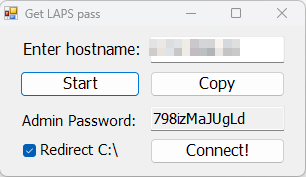

# Get-LAPS-pass

Get-LAPS-pass is a PowerShell script designed to streamline the process of retrieving and utilizing Local Administrator Password Solution (LAPS) passwords. The script provides a user-friendly graphical interface (GUI) for inputting hostnames, retrieving passwords, and connecting to remote systems using Remote Desktop Protocol (RDP).

## Features

- **Retrieve LAPS Passwords**: Enter a hostname and retrieve the associated LAPS-managed local administrator password.
- **Password Display**: View the retrieved password directly in the GUI.
- **Copy to Clipboard**: Copy the retrieved password to your clipboard with a single click.
- **RDP Connection**: Establish an RDP connection to the specified hostname with the retrieved credentials.
- **Error Handling**: Displays error messages in case of issues during password retrieval.

## Prerequisites

1. **Windows Environment**: The script is designed to run on Windows.
2. **PowerShell**: Ensure PowerShell is installed and up-to-date.
3. **LAPS Module**: The script uses the `Get-LapsADPassword` cmdlet, which requires the LAPS PowerShell module to be installed.
4. **Permissions**: The user running the script must have appropriate permissions to retrieve LAPS passwords.
5. **Config File**: A `config.json` file in the same directory as the script, with the following structure:
   ```json
   {
       "SearchTemplate": "template-hostname",
       "UserForConnect": "administrator"
   }
   ```

## Installation

1. Clone this repository or download the script and executable:
   ```sh
   git clone https://github.com/yourusername/Get-LAPS-pass.git
   ```
2. Ensure the required `config.json` file is present in the script's directory.
3. Install the LAPS PowerShell module if not already installed:
   ```powershell
   Install-Module -Name LAPS
   ```

## Usage

1. Run the script in PowerShell:
   ```powershell
   .\Get-LAPS-pass.ps1
   ```
   Alternatively, you can use the precompiled executable file (`Get-LAPS-pass.exe`) for easier launching without opening PowerShell.

2. In the GUI:
   - Enter the hostname of the target computer.
   - Click **Start** to retrieve the password.
   - The password will be displayed in the password field.
   - Optionally, click **Copy** to copy the password to your clipboard.
   - Click **Connect!** to establish an RDP connection using the retrieved credentials.

3. Use the **Enter** key as a shortcut for the **Start** button or the **Escape** key to close the application.

## GUI Overview

- **Enter Hostname**: Input field for the target computer's hostname.
- **Start**: Button to retrieve the LAPS password.
- **Admin Password**: Field where the retrieved password is displayed.
- **Copy**: Button to copy the password to your clipboard.
- **Connect!**: Button to start an RDP session with the retrieved credentials.

### Screenshot

Below is a screenshot of the Get-LAPS-pass GUI:



## Error Handling

If an error occurs during password retrieval, the password field will display `Error`, and an appropriate message box will appear.

## Customization

Modify the `config.json` file to customize the default hostname and username used for RDP connections:
- `SearchTemplate`: Default hostname shown in the input field.
- `UserForConnect`: Default username used in RDP connections.

## Limitations

- The script assumes that the `Get-LapsADPassword` cmdlet is available and functional.
- It relies on the `config.json` file for certain configurations.
- Designed for use in environments where LAPS is implemented.

## License

This project is licensed under the [MIT License](LICENSE).

## Contributing

Contributions are welcome! Feel free to submit issues or pull requests.

## Acknowledgments

- [Microsoft LAPS](https://www.microsoft.com/en-us/download/details.aspx?id=46899) for the password management solution.

## Disclaimer

Use this script responsibly and ensure compliance with your organization's security policies.

